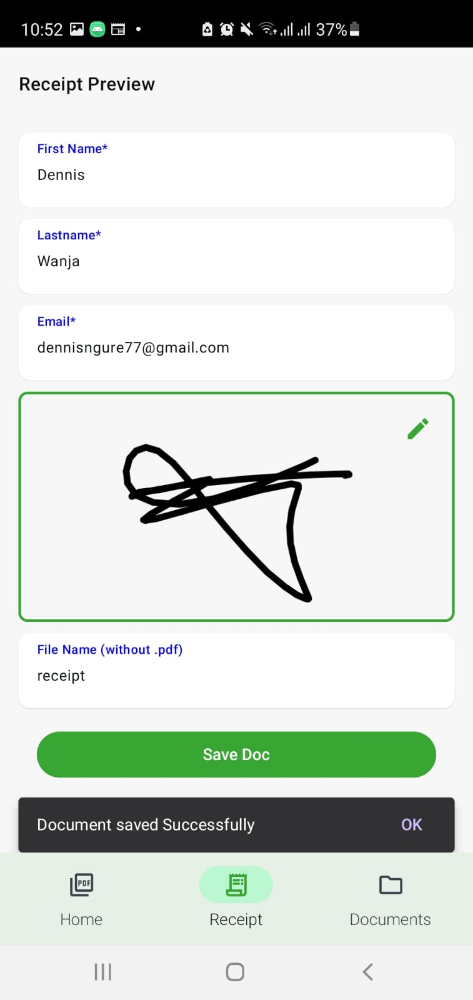
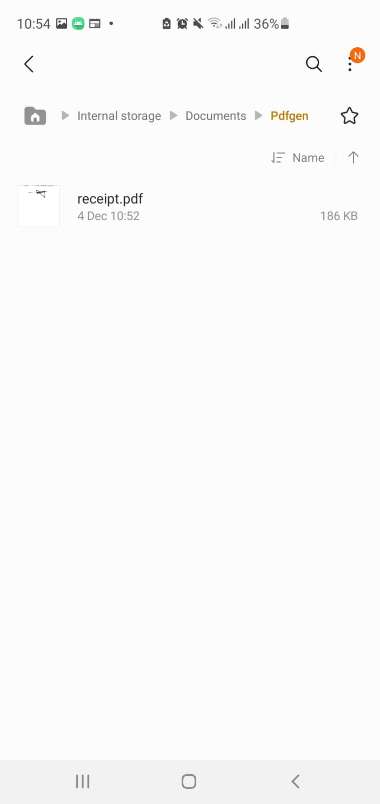

# Compose Multiplatform PDFGenerator

This is a Kotlin Multiplatform project targeting Android, iOS with illustrations on how to create a pdf on Android/iOS. 
 For those with Xcode versions older  than 15 clone from  the mainCopy Branch.

* `/composeApp` is for code that will be shared across your Compose Multiplatform applications.
  It contains several subfolders:
  - `commonMain` is for code that’s common for all targets.
  - Other folders are for Kotlin code that will be compiled for only the platform indicated in the folder name.
    For example, if you want to use Apple’s CoreCrypto for the iOS part of your Kotlin app,
    `iosMain` would be the right folder for such calls.

* `/iosApp` contains iOS applications. Even if you’re sharing your UI with Compose Multiplatform, 
  you need this entry point for your iOS app. This is also where you should add SwiftUI code for your project.

Learn more about [Kotlin Multiplatform](https://www.jetbrains.com/help/kotlin-multiplatform-dev/get-started.html)… 

libraries
#Decompose 
 
What is Decompose?¶ 
Decompose is a Kotlin Multiplatform library for breaking down your code into lifecycle-aware business logic components (aka BLoC), with routing functionality and pluggable UI (Jetpack Compose, Android Views, SwiftUI, JS React, etc.). 
https://arkivanov.github.io/Decompose/getting-started/quick-start/ 
https://github.com/arkivanov/Decompose 

#swift-klib-plugin 
This gradle plugin provides easy way to include your Swift source files in your Kotlin Multiplatform Mobile shared module and access them in Kotlin via cinterop for iOS targets. 
https://github.com/ttypic/swift-klib-plugin 

## Screenshots

### Android

    <!-- Top row of images -->
    

        
        
        
    

    <!-- Image below -->
    

### iOS

    <!-- Top row of images -->
    

        
        
    

    <!-- Image below -->
    

